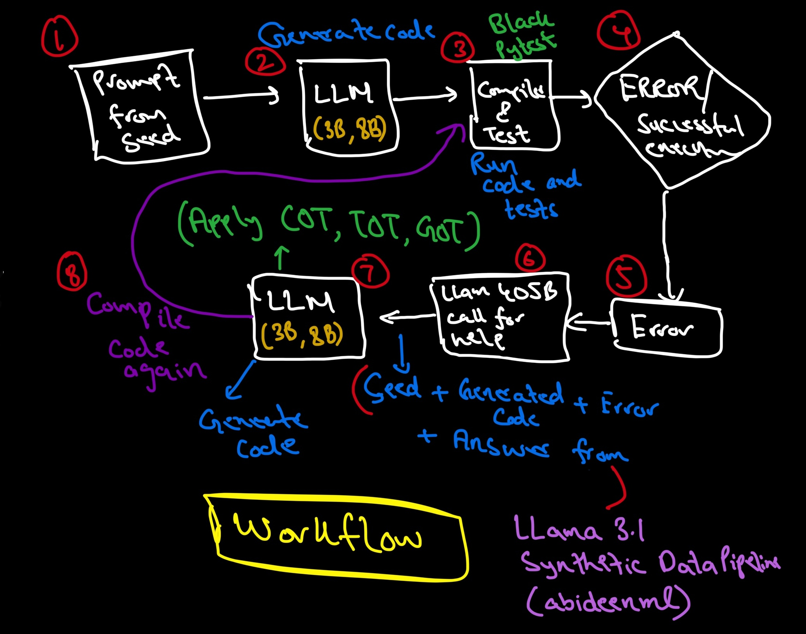

# Llama3.1 Synthetic Data Pipeline
Implementation of Synthetic data (code) pipeline of Llama 3.1 using Langgraph, Groq, Pytest and Black. LLama 3.1 Paper: https://arxiv.org/abs/2407.21783 (Pages 19-22)



```bash

## Research log

2024-08-14
----------
inference is slow in case of hermes, have to add vllm.

2024-08-12
----------
error regarding states solved and now testing the pipeline with hermes model.

2024-08-11
----------
self-healing with call to llama3.1-405B/gpt4-o/sonnet for solution generation and then regeneration done.

2024-08-07
----------
unit test generation and dynamic analysis of code with pytest added.

2024-08-04
----------
compiler agent with static analysis from black added.

2024-08-02
----------
code generator made and instructor/outlines tried for json mode. Phi3 model in use now. will change to llama31 later.                         
                            
2024-07-31
----------
langgraph states setup and agent class.

2024-07-24
----------
llama3.1 paper release and basic architecture for this project laid down considering 
its familiarity with claude code generation and self-healing process.

```


## Setup


Let's get this thing running! Follow the next steps:

1. `https://github.com/abideenml/Llama3.1-SyntheticDataPipeline`
2. Navigate into project directory `cd Llama3.1-SyntheticDataPipeline`
3. Create a new venv environment and run `pip install -e .`
4. Load your initial seed dataset from huggingface and run the `SyntheticDataGeneration.ipynb` notebook.


That's it!<br/>


## ✅ Features

This repo supports:
* Langgraph for code generation, compilation, validation, and self healing pipeline
* Hf inference (currently)
* Black for code formatting and syntax checking
* Instructor for json mode (failed)
* Pytest for running tests for the code generated
* Llama 3.1 8B and Hermes 8B for code generation and analysis.

## 🤞 Todos

Finally there are a couple more todos which I'll hopefully add really soon:
* Add other programming languages like JS, C++, Rust..
* Add groq api client for llama 3.1 405B
* Make a modular structure of the entire pipeline
* Fine-tune a model on data generated by this pipeline
* Make the testing criteria more dynamic
* vllm support for model inference


## 🦋 Citation

If you find this code useful, please cite the following:

```
@misc{Zain2024Llama3.1-SyntheticDataPipeline,
  author = {Zain, Abideen},
  title = {Llama3.1-SyntheticDataPipeline},
  year = {2024},
  publisher = {GitHub},
  journal = {GitHub repository},
  howpublished = {\url{https://github.com/abideenml/Llama3.1-SyntheticDataPipeline}},
}
```

## Connect with me

If you'd love to have some more AI-related content in your life :nerd_face:, consider:

* Connect and reach me on [LinkedIn](https://www.linkedin.com/in/zaiinulabideen/)
* Follow me on 📚 [Medium](https://medium.com/@zaiinn440)
* Check out my 🤗 [HuggingFace](https://huggingface.co/abideen)